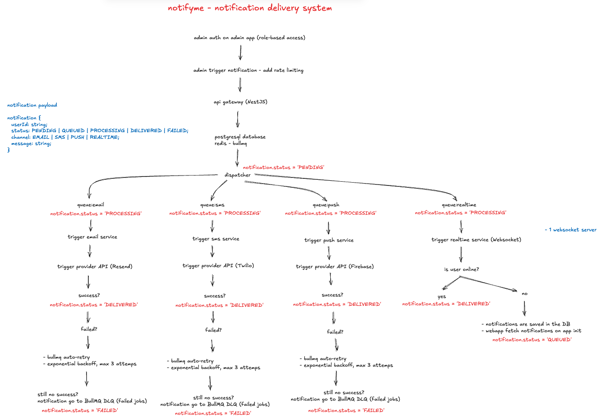

# notification-delivery-app

A multi-channel notification delivery system built with NestJS, BullMQ, Redis, and PostgreSQL. Supports Email, SMS, Push, and real-time in-app notifications via WebSocket.

## System Design



## Stack

| Layer     | Tech                                     |
| --------- | ---------------------------------------- |
| Monorepo  | Turborepo + pnpm workspaces              |
| Web app   | React 18 + Vite + TypeScript + shadcn/ui |
| Admin app | React 18 + Vite + TypeScript + shadcn/ui |
| API       | NestJS 10 + TypeScript                   |
| Queue     | BullMQ + Redis                           |
| Database  | PostgreSQL 16                            |
| ORM       | TypeORM                                  |
| Email     | Resend API                               |
| SMS       | Twilio API                               |
| Push      | Firebase API                             |
| Realtime  | WebSocket                                |

## Structure

```
apps/
├── web/      # User-facing app — receives real-time notifications (port 3000)
├── admin/    # Admin app — triggers notifications with RBAC (port 3002)
└── api/      # NestJS API gateway + queue processors (port 3001)
```

## Notification channels implemented

- [x] Email
- [x] SMS
- [ ] Push notification
- [ ] Realtime

## Notification Payload

```ts
{
  userId: string;
  status: 'PENDING' | 'QUEUED' | 'PROCESSING' | 'DELIVERED' | 'FAILED';
  channel: 'EMAIL' | 'SMS' | 'PUSH' | 'REALTIME';
  message: string;
}
```

## Delivery Flow

1. Admin triggers a notification via the admin app
2. API receives the request, persists it with `status: PENDING`, and enqueues it
3. Dispatcher routes to the correct BullMQ queue: `queue:email`, `queue:sms`, `queue:push`, or `queue:realtime`
4. Each queue processor sets `status: PROCESSING` and calls the respective provider
5. On success → `status: DELIVERED`. On failure → exponential backoff, up to 3 retries → `status: FAILED` + DLQ

**Realtime channel:** if the user is online, the notification is pushed immediately via WebSocket. If offline, it's saved to the database and fetched on app init.

## Functional Requirements

**Admin**

- Role-based authentication on the admin app
- Trigger notifications with rate limiting
- Send to one or more users simultaneously
- Select delivery channel: Email, SMS, Push, or Realtime

**Web App (User)**

- Receive in-app notifications in real time via WebSocket
- List received notifications
- Mark notifications as read
- View notification delivery history

## Non-Functional Requirements

**Reliability**

- Each channel processor is independent — a failure in SMS does not affect Email, Push, or Realtime

**Retry & Fault Tolerance**

- Automatic retry with exponential backoff, max 3 attempts
- Failed jobs move to a Dead Letter Queue (DLQ) for inspection and manual reprocessing
- No notification data is lost on failure

**Async Processing**

- The API responds immediately after queuing — no waiting for delivery confirmation
- Dedicated BullMQ queues per channel: `queue:email`, `queue:sms`, `queue:push`, `queue:realtime`

**Persistence**

- PostgreSQL is the source of truth for all notification state and history
- Redis (BullMQ) handles queue state; PostgreSQL ensures durability across restarts

## Getting Started

**Prerequisites:** Node 20+, pnpm, Docker

```bash
# 1. Install dependencies
pnpm install

# 2. Start the database
cp .env.example .env
docker compose up -d

# 3. Configure the API
cp apps/api/.env.example apps/api/.env

# 4. Run everything
pnpm dev
```
